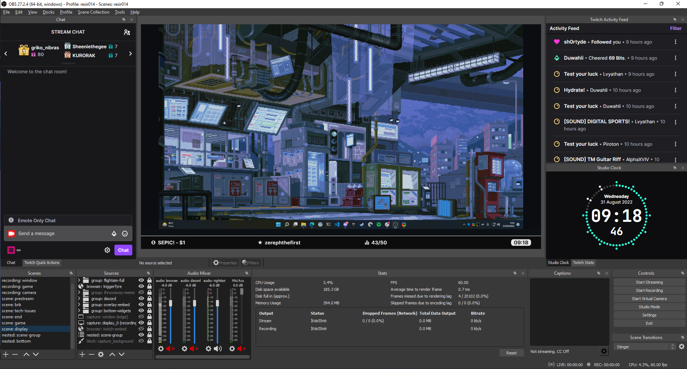

# stream-overlays

> Dynamic stream overlays/widgets for OBS.

## Developing

A nodejs LTS setup with [yarn](https://yarnpkg.com/) is recommended.

```bash
# install dependencies
yarn

# serve with hot reload at localhost:3000
yarn dev

# build for production
yarn build

# run tests (lint + type check)
yarn test
```

## Preview

### Display Capture



### Gaming


### Titlecards


