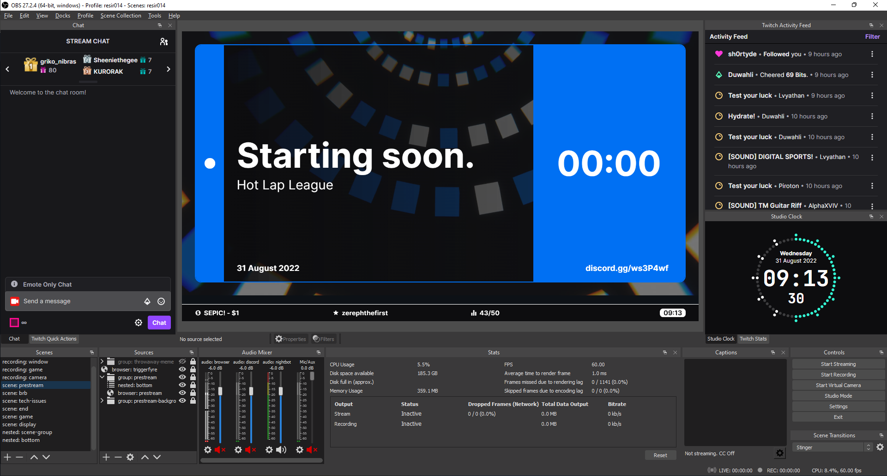

# stream-overlays

> Dynamic stream overlays/widgets for OBS.

## Developing

A nodejs LTS setup with [pnpm](https://pnpm.io/) is recommended.

```bash
# install dependencies
pnpm install

# serve with hot reload at localhost:3000
pnpm run dev

# build for production
pnpm run build

# run tests (lint + type check)
pnpm run test
```

## Preview

### Display Capture


### Gaming


### Titlecards


